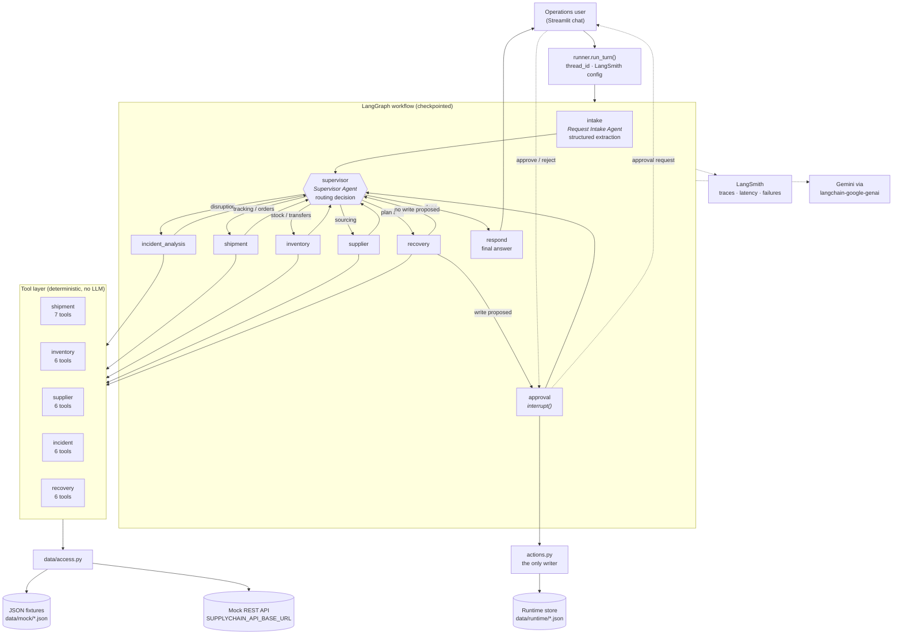

# Architecture

NovaRetail Supply Chain Disruption Management Platform.

One assistant on the surface; six agents, a supervisor and a deterministic tool
layer underneath.

## System overview



## Agents

| Agent | Kind | Tools | Responsibility |
|---|---|---|---|
| `intake` | Structured output, no tools | – | Classify the request, extract every identifier, resolve references to earlier turns, flag missing information and unsupported requests. |
| `supervisor` | Structured output, no tools | – | Decide which agent handles the request next; stop when the question is answered. |
| `incident_analysis` | ReAct | 7 | Establish the facts, quantify damage, classify severity with the rule engine. |
| `shipment` | ReAct | 7 | Track shipments, quantify delays, find affected orders, check routes. |
| `inventory` | ReAct | 6 | Stock positions, shortages, required quantities, transfer options. |
| `supplier` | ReAct | 6 | Supplier profiles, availability, alternatives, procurement cost. |
| `recovery` | ReAct | 6 | Rank recovery options, cost them, propose incidents / reroutes / escalations. |
| `respond` | Single LLM call | – | Write the one answer the user sees. |

Each worker is a LangChain 1.x `create_agent` tool-calling loop over its own
tool list (the current successor to `langgraph.prebuilt.create_react_agent`),
compiled to a LangGraph and invoked as a unit by the outer graph. Workers do not
see the raw conversation — they receive a briefing built from the intake summary
plus what the other agents have already established
(`agents/base.build_context_block`). That keeps each agent's trace focused and
its token cost predictable.

## Shared state

`state.SupplyChainState` is the single contract between nodes — this is what
lets four people build agents in parallel.

| Field | Reducer | Purpose |
|---|---|---|
| `messages` | `add_messages` | Conversation history (memory across turns). |
| `user_request` | last write | The current turn's text. |
| `request` | last write | Serialised `IntakeResult`. |
| `next_agent`, `route_reason`, `route_task` | last write | The supervisor's decision. |
| `hops`, `visited` | last write | Loop guard and route trace. Reset per turn by `intake`. |
| `findings` | `merge_findings` | Per-agent summary + tool calls. |
| `severity` | last write | Output of `classify_incident_severity`. |
| `pending_action` | last write | Write action awaiting approval. |
| `approval_decision`, `executed_actions` | last write / append | HITL outcome. |
| `final_response` | last write | The answer. |

`hops` and `visited` are deliberately *not* accumulating reducers: with a
persistent checkpointer an accumulating counter would exhaust the loop guard
after a few conversational turns.

## Two properties enforced by structure, not by prompting

**Loop guard.** `supervisor_node` increments `hops` and forces `respond` once
`SUPPLYCHAIN_MAX_HOPS` is exceeded. A confused router cannot spin forever, and
`tests/test_graph.py::test_fallback_policy_terminates_from_every_state` walks
the deterministic policy to exhaustion for every incident type.

**Human-in-the-loop.** The Recovery Agent has no write tools. It has
`propose_incident`, `propose_reroute` and `propose_escalation`, which return the
action they *would* take. The graph reads the proposal back out of the agent's
own tool calls (`find_pending_proposal`), routes to the `approval` node, and
that node calls `interrupt()`. Only after a human approves does
`actions.execute` touch the data. The model cannot skip the gate, because the
gate is an edge in the graph rather than an instruction in a prompt.

`approval` has no side effects before its `interrupt()`, so LangGraph's re-entry
on resume is safe.

## Routing policy

The supervisor is an LLM call with structured output (`RouteDecision`). If that
call fails — rate limit, transient 5xx, schema refusal — `supervisor._fallback_decision`
applies a deterministic table instead:

```
disruption      → incident_analysis → (shipment | inventory | supplier) → recovery → respond
status query    → shipment → recovery → respond
shortage        → inventory → supplier → recovery → respond
unsupported     → respond
```

The same degradation applies to intake: `agents/intake._regex_intake` extracts
identifiers by regex so a routing decision is always possible. The UI surfaces
which path was used (`request.extracted_by`), and it is in the LangSmith
metadata too.

## Tool layer

Tools are plain Python over `data/access.py`, with no LLM involvement — which is
why they can be unit-tested for exact numbers. Two conventions:

1. **Results are JSON strings.** Stable, parseable shape for the model.
2. **Failures are data, not exceptions.** A bad id returns
   `{"error": ..., "hint": ..., "sample_ids": [...]}` so the agent can correct
   itself instead of the run aborting.

Severity classification lives in a tool (`classify_incident_severity`), not in
a prompt, so the same disruption always scores the same way and the reasoning is
auditable in a trace.

## Data layer

`data/access.py` is the only module that reads files or makes HTTP calls.

- **Default:** committed JSON fixtures in `src/supplychain/data/mock/`,
  generated by `scripts/generate_mock_data.py` from a fixed seed.
- **Mock REST API:** set `SUPPLYCHAIN_API_BASE_URL` and every collection is
  fetched from `{base}/{collection}` instead. No tool code changes.
- **Writes:** approved actions go to `src/supplychain/data/runtime/*.json`
  (git-ignored) and are layered over the fixtures on read, so demo runs never
  dirty the committed dataset. `access.reset_runtime_store()` resets it.

## Model configuration

Provider: **Google AI (Gemini)** via `langchain-google-genai`, constructed
through LangChain 1.x's provider-agnostic `init_chat_model` in
[`llm.py`](../src/supplychain/llm.py).

| Call site | Model | Reasoning effort | Output budget | Why |
|---|---|---|---|---|
| Worker agents, responder | `SUPPLYCHAIN_MODEL` (default `gemini-3.1-flash-lite`) | `SUPPLYCHAIN_REASONING_EFFORT` (default `medium`) | `SUPPLYCHAIN_MAX_OUTPUT_TOKENS` (4096) | Multi-step tool reasoning. |
| Intake, supervisor | same model | `SUPPLYCHAIN_ROUTER_REASONING_EFFORT` (default `low`) | ≤ 2048 | Short extraction/classification steps on the critical path of every turn. |

`reasoning_effort` (`minimal` / `low` / `medium` / `high`) is how
langchain-google-genai exposes Gemini's `thinking_level`. Invalid values fall
back to the default rather than failing at request time
(`config._effort`). Temperature is deliberately left unset — Google recommends
leaving Gemini 3.x at its default sampling settings and controlling depth with
reasoning effort instead.

Switching provider means changing `MODEL_PROVIDER` and the key in `llm.py`; no
agent, tool or graph code refers to Gemini directly.

## Observability

`observability.configure_tracing()` translates our settings into the
environment variables the LangChain tracer reads.
`observability.run_config(thread_id)` attaches the `thread_id`, model, effort
and data source as LangSmith metadata on every run, which is how a trace is
correlated back to a conversation. `scripts/run_eval_conversations.py` runs the
12-conversation evaluation set and writes latency statistics to
`docs/eval_runs.json`.

## Extension points

| Want to… | Change |
|---|---|
| Add a tool | Add the `@tool` to the right module, append it to that module's `*_TOOLS` list. |
| Add an agent | Prompt in `prompts.py`, tool list in `agents/base.AGENT_TOOLS`, node + edges in `graph.py`, name in `state.RouteDecision`. |
| Swap the Gemini model | `SUPPLYCHAIN_MODEL` in `.env`. |
| Swap the provider entirely | `MODEL_PROVIDER` + the key in `llm.py`; nothing else refers to Gemini. |
| Point at real APIs | `SUPPLYCHAIN_API_BASE_URL` in `.env`. |
| Persist conversations | Pass a durable checkpointer to `build_graph()`. |
| Turn off the approval gate for a demo | `SUPPLYCHAIN_REQUIRE_APPROVAL=false`. |
